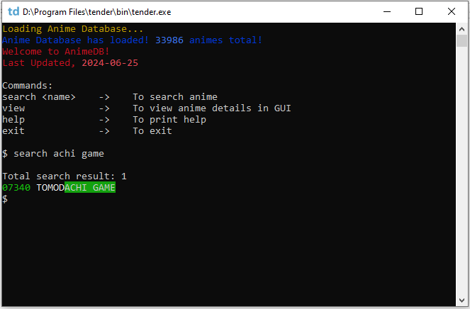

# AnimeDB

AnimeDB is a CLI-based offline anime database built using [Tender](https://github.com/2dprototype/tender-free). It allows you to easily search for and view detailed information about your favorite anime from the [anime-offline-database](https://github.com/manami-project/anime-offline-database).

## Preview




## Quick Start

1. **Download and Set Up Tender**:  
   Follow the instructions in the [Tender repository](https://github.com/2dprototype/tender-free) to set it up on your machine.

2. **Run the Application**:  
   After setting up, run the following command in your terminal:
   ```bash
   tender main.td
   ```
   And you're all set!

## Updating the Database

We do not guarantee regular updates to the [db.json](db.json). However, you can update it manually. Simply download the [anime-offline-database-minified.json](https://github.com/manami-project/anime-offline-database/blob/master/anime-offline-database-minified.json) and replace the existing [db.json](db.json).

## Commands

In app commands:

```
Commands:
search <name>    ->    To search for an anime by its name
view             ->    To view anime details in a graphical user interface (GUI)
help             ->    To display this help message
exit             ->    To exit the application
```

## Platform

This program can run on any platform where Tender is supported. However, the view function is only available on Windows.


## License

This project is licensed under the MIT License. See the [LICENSE](LICENSE) file for details.

## Acknowledgments

Special thanks to the [anime-offline-database](https://github.com/manami-project/anime-offline-database).